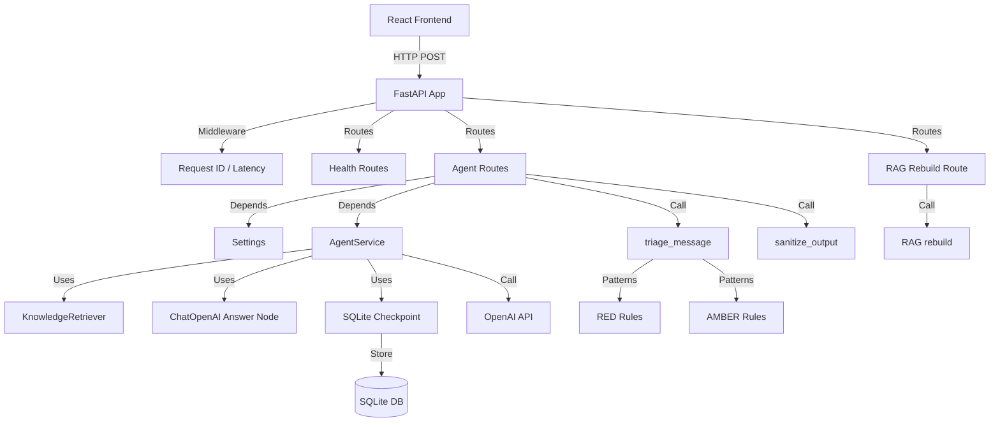

# System Architecture

## Overview

FastAPI LangGraph Agent Service는 건강 불안정을 겪는 사용자를 위한 AI 기반 대화 지원 시스템입니다. **FastAPI**, **LangChain/LangGraph**, **SQLite/PostgreSQL**를 기반으로 한 3-tier 아키텍처를 채택하고 있습니다.

## Layer Structure

```
┌─────────────────────────────────────────────────────────────┐
│                        Client Layer                         │
│  React + TypeScript (Frontend)                               │
│  - ChatInterface: 대화 UI                                    │
│  - API Client: Axios HTTP client                             │
└───────────────────────┬─────────────────────────────────────┘
                        │ HTTP/REST
┌───────────────────────▼─────────────────────────────────────┐
│                      API Layer                              │
│  FastAPI (Python)                                           │
│  ├─ Middleware: request_id, latency tracking                │
│  ├─ Routes: /health/*, /api/v1/agent/*, /api/v1/rag/*      │
│  ├─ Safety: Triage (RED/AMBER/GREEN)                        │
│  └─ Dependencies: Settings, AgentService injection          │
└───────────────────────┬─────────────────────────────────────┘
                        │
┌───────────────────────▼─────────────────────────────────────┐
│                   Service Layer                             │
│  ┌─────────────────────────────────────────────────────┐   │
│  │ AgentService (LangGraph)                            │   │
│  │ ├─ ChatOpenAI (GPT-4o-mini)                        │   │
│  │ ├─ Retrieval node (OpenAI embeddings + JSON index)│   │
│  │ ├─ StateGraph (MessagesState)                      │   │
│  │ ├─ Answer node (ChatOpenAI)                        │   │
│  │ └─ SQLite/Memory Checkpoint                         │   │
│  └─────────────────────────────────────────────────────┘   │
│                                                              │
│  ┌─────────────────────────────────────────────────────┐   │
│  │ SafetyService                                       │   │
│  │ ├─ triage_message(): RED/AMBER/GREEN               │   │
│  │ ├─ _SECURITY_RED_PATTERNS: prompt injection        │   │
│  │ ├─ _CRISIS_PATTERNS: self-harm detection           │   │
│  │ ├─ _EMERGENCY_COMBINATIONS: chest pain + SOB       │   │
│  │ └─ sanitize_output(): secret redaction             │   │
│  └─────────────────────────────────────────────────────┘   │
└───────────────────────┬─────────────────────────────────────┘
                        │
┌───────────────────────▼─────────────────────────────────────┐
│                   Data Layer                                │
│  SQLite (default) / PostgreSQL (production)                 │
│  - agent_checkpoints.sqlite: 대화 상태 저장                 │
│  - thread_id 기반 체크포인팅                                │
└─────────────────────────────────────────────────────────────┘
```

## Dependency Graph



## Component Details

### 1. FastAPI Application (`app/main.py`)

| Component | Responsibility |
|-----------|---------------|
| **Middleware** | Request ID 생성, latency 측정, observability headers 추가 |
| **Router Mounting** | `/health`, `/api/v1/agent` prefix로 라우터 등록 |
| **App Factory** | `create_app()`으로 앱 인스턴스 생성, 테스트/배포 재사용 |

### 2. Safety System (`app/services/safety.py`)

#### Triage Levels

| Level | Condition | Action | Example |
|-------|-----------|--------|---------|
| **RED** | 응급상황, 보안 위협 | HTTP 400 차단 | "chest pain + shortness of breath" |
| **AMBER** | 주의 필요, 심각 증상 | Proceed with caution metadata | "fever for 3 days" |
| **GREEN** | 일반 대화 | Normal flow | "how are you today?" |

#### Pattern Matching

```python
_SECURITY_RED_PATTERNS = [
    r"ignore\s+(?:all\s+)?previous\s+instructions",  # Prompt injection
    r"api\s*key", r"password", r"secret\s*key",       # Secret requests
]

_CRISIS_PATTERNS = [
    (r"\b(suicide|kill\s+myself|end\s+my\s+life)\b", "self-harm"),
    (r"\b(자해|죽고\s*싶|극단적\s*선택)\b", "self-harm KO"),
]

_EMERGENCY_COMBINATIONS = [
    ([r"chest\s+pain", r"shortness\s+of\s+breath"], "cardiopulmonary emergency"),
    ([r"가슴\s*통증", r"호흡\s*곤란"], "cardiopulmonary emergency KO"),
]
```

### 3. Agent Service (`app/services/agent_graph.py`)

```python
class AgentService:
    - model: ChatOpenAI (GPT-4o-mini)
    - retriever: KnowledgeRetriever
    - graph: StateGraph(AgentState)
    - checkpointer: SqliteSaver / InMemorySaver
```

#### Conversation Flow

```
User Request
    ↓
AgentService.invoke(message, thread_id)
    ↓
StateGraph.invoke({"messages": [HumanMessage]}, config={"thread_id": ...})
    ↓
Retrieve Node → JSON RAG Index + OpenAI Embeddings
    ↓
Answer Node → ChatOpenAI
    ↓
Response with conversation state + retrieved source metadata
    ↓
SQLite Checkpoint 저장
```

### 4. Checkpointing System

| Aspect | Implementation |
|--------|---------------|
| **Default** | SQLite (`data/agent_checkpoints.sqlite`) |
| **Fallback** | InMemory (if sqlite package unavailable) |
| **Key** | `thread_id` - conversation identifier |
| **Use case** | Same `thread_id` = continue conversation |

## Data Flow

### Request Flow

```
1. Client POST /api/v1/agent/invoke
   Body: {"message": "가슴이 아파요", "thread_id": "user-123"}

2. FastAPI receives request
   - Middleware: request_id = uuid4(), start_time = now()

3. Agent route processing
   a. readiness check (OPENAI_API_KEY configured?)
   b. triage_message("가슴이 아파요") → RED (chest pain detected)
   c. Return HTTP 400 with block reason

4. If GREEN/AMBER:
   a. AgentService.invoke(message, thread_id)
   b. LangGraph loads checkpoint by thread_id
   c. Build a retrieval query from recent user turns
   d. Optionally rewrite that query with the LLM
   e. Retrieve supporting chunks from the RAG index
   f. OpenAI API call with grounded context
   g. Response sanitization
   h. Return JSON with metadata + retrieved sources

5. Middleware adds headers
   - X-Request-ID, X-Latency-Ms
```

### Response Schema

```json
{
  "output": "AI generated response",
  "thread_id": "user-123",
  "model": "gpt-4o-mini",
  "metadata": {
    "triage_level": "GREEN",
    "triage_reasons": [],
    "fallback_used": false,
    "guardrail_sanitized": false,
    "sanitizer_reasons": [],
    "request_id": "550e8400-e29b-41d4-a716-446655440000",
    "retrieval_used": true,
    "retrieved_sources": [
      {
        "chunk_id": "faq-chunk-1",
        "source": "knowledge-base/faq.md",
        "title": "FAQ",
        "score": 0.91
      }
    ]
  }
}
```

## Tech Stack

| Category | Technology | Version | Purpose |
|----------|------------|---------|---------|
| **Web Framework** | FastAPI | Latest | High-performance API |
| **AI Framework** | LangChain | ^0.1.x | LLM orchestration |
| **Agent Framework** | LangGraph | ^0.0.x | Conversation state management |
| **LLM Provider** | OpenAI | GPT-4o-mini | Language model |
| **Data Validation** | Pydantic | v2 | Request/response schemas |
| **Settings** | pydantic-settings | Latest | Environment configuration |
| **Database** | SQLite | Built-in | Checkpoint storage |
| **Testing** | pytest | Latest | API contract tests |
| **Container** | Docker | Latest | Production deployment |

## Key Patterns

### 1. Dependency Injection

FastAPI의 `Depends()`를 사용한 의존성 주입:

```python
@router.post("/invoke")
def invoke_agent(
    settings: Settings = Depends(get_settings),
    agent_service: AgentService = Depends(get_agent_service),
):
    # Injectable for testing
```

### 2. Singleton Pattern

`@lru_cache`로 싱글톤 보장:

```python
@lru_cache
def get_settings() -> Settings:
    return Settings()

@lru_cache
def get_agent_service() -> AgentService:
    return AgentService(get_settings())
```

### 3. Error Handling

```python
try:
    result = agent_service.invoke(...)
except ModelProviderError as exc:
    # Return fallback message
    return {"output": settings.agent_fallback_message, ...}
```

### 4. Middleware Chain

```
HTTP Request
    ↓
add_request_context middleware
    ↓
Router matching
    ↓
Endpoint handler
    ↓
Middleware response processing
    ↓
HTTP Response (with headers)
```

## Scalability Considerations

### Current (Single Server)
- SQLite: single process only
- In-memory state: no horizontal scaling

### Production Upgrade Path
1. **SQLite → PostgreSQL**: `langgraph-checkpoint-postgres`
2. **Single → Multiple**: Load balancer + shared PostgreSQL
3. **Container Orchestration**: ECS/EKS with Docker
4. **Caching**: Redis for frequent requests

## Security Architecture

| Layer | Protection |
|-------|-----------|
| **Network** | Security Groups (port restrictions) |
| **Application** | Input triage (RED blocking) |
| **Data** | Output sanitization (secret removal) |
| **Infrastructure** | Environment variables (no hardcoded secrets) |
| **Monitoring** | Request ID for audit trail |
