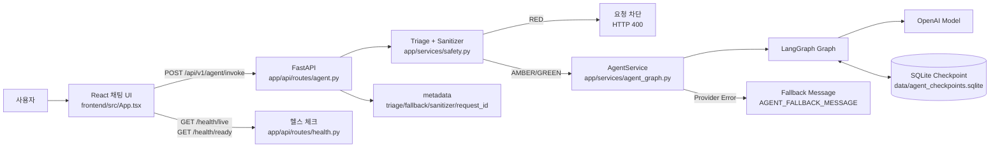
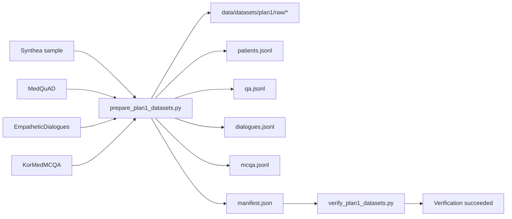
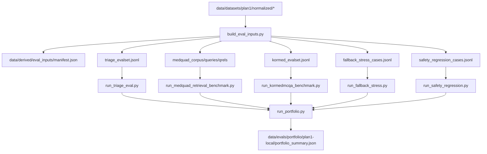
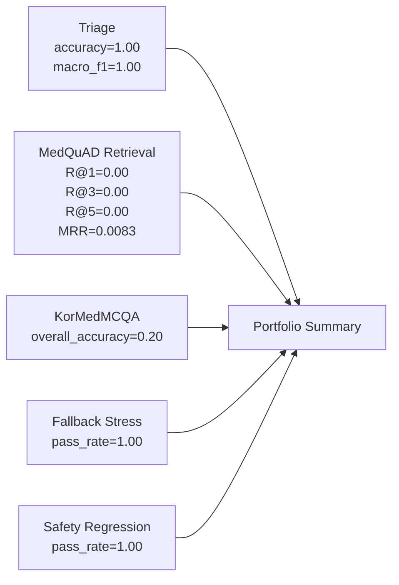

# Project Progress Diagram

이 문서는 현재 시스템의 런타임 구조, 안전성 분기, 데이터 파이프라인, 평가 파이프라인을 한 파일에 정리한 통합 다이어그램 문서다.

---

## 1) 런타임 아키텍처



## 2) 안전 분기 플로우 / Safety Decision Flow

```mermaid
flowchart TD
    A[Incoming message] --> B[triage_message]
    B -->|RED| C[Block request\nHTTP 400]
    B -->|AMBER| D[Invoke agent with caution metadata]
    B -->|GREEN| E[Invoke agent normal path]

    D --> F[sanitize_output]
    E --> F
    F --> G{Sensitive pattern found?}
    G -->|Yes| H[Replace with [REDACTED]\nmark guardrail_sanitized=true]
    G -->|No| I[Return original output]

    D --> J{Provider/model failure?}
    E --> J
    J -->|Yes| K[Return fallback response\nfallback_used=true]
    J -->|No| L[Return model response]
```

## 3) 데이터 부트스트랩 / Data Bootstrap Pipeline



## 4) 평가 파이프라인 / Evaluation Pipeline



## 5) 현재 메트릭 / Current Metrics Snapshot



## Key Artifact Paths
- Data manifest: `data/datasets/plan1/normalized/manifest.json`
- Eval input manifest: `data/derived/eval_inputs/manifest.json`
- Portfolio summary: `data/evals/portfolio/plan1-local/portfolio_summary.json`
- Narrative reference: `docs/data/plan1-portfolio-playbook.md`
